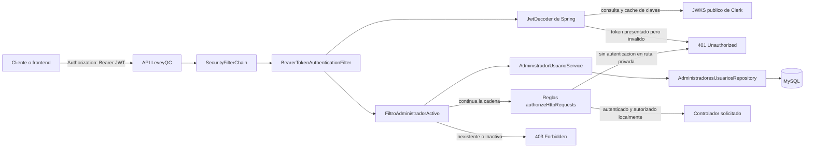
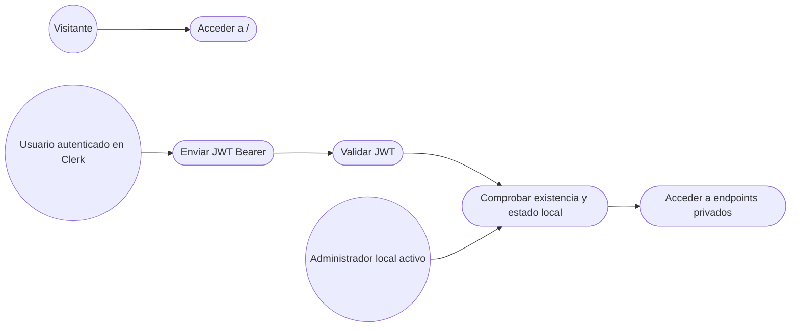
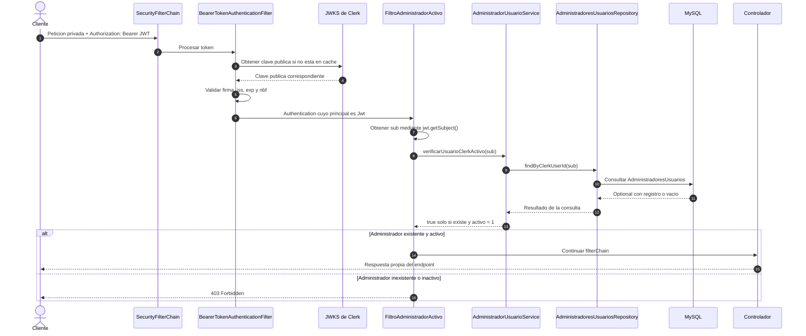
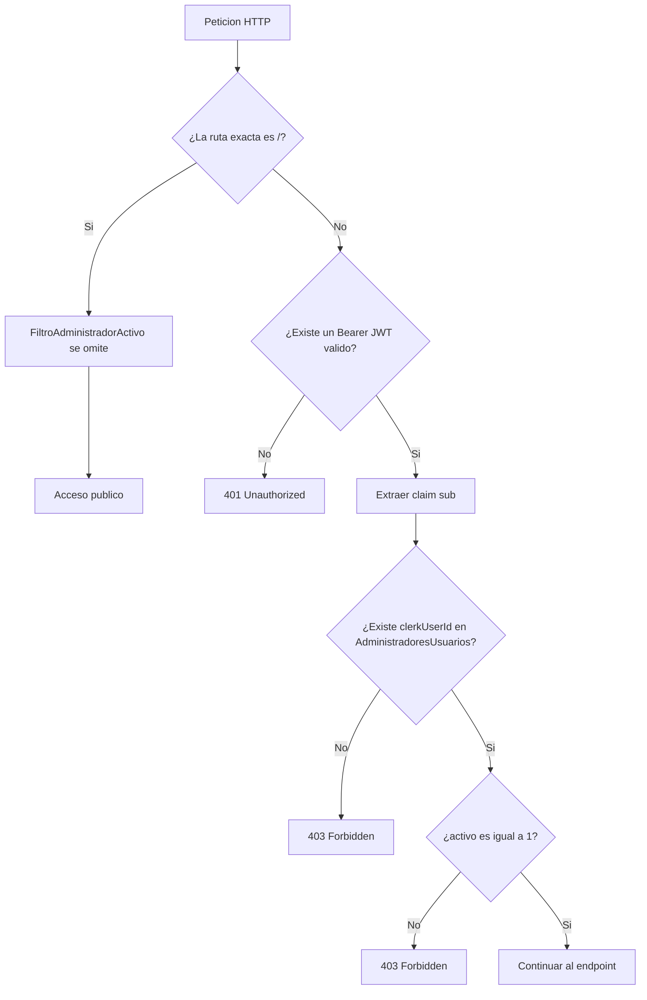
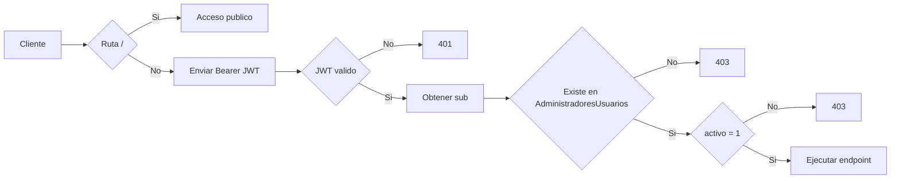

# Seguridad con Clerk en LeveyQC

## 1. Objetivo del documento

Este documento describe la implementacion actual de autenticacion y control de acceso de LeveyQC. El alcance documentado corresponde al codigo presente en el proyecto al 25 de agosto de 2026.

La regla de acceso acordada es:

- La ruta exacta `/` es publica.
- Todas las demas rutas requieren un JWT de sesion valido emitido por Clerk.
- Un JWT valido identifica al usuario mediante el claim `sub`.
- El valor de `sub` debe existir como `clerkUserId` en `AdministradoresUsuarios`.
- El administrador local debe tener `activo = 1`.
- Todos los administradores activos tienen acceso a todos los endpoints privados.
- Un usuario autenticado en Clerk que no existe localmente, o que esta inactivo, recibe `403 Forbidden`.

Esta implementacion diferencia dos conceptos:

| Capa | Responsable | Pregunta que responde |
|---|---|---|
| Autenticacion | Clerk y Spring Security | ¿El JWT es autentico, vigente y fue emitido por la instancia configurada? |
| Autorizacion local | LeveyQC y MySQL | ¿El usuario identificado por `sub` existe en `AdministradoresUsuarios` y esta activo? |

## 2. Estado actual resumido

El flujo basico esta conectado de extremo a extremo:

```text
Peticion privada
→ BearerTokenAuthenticationFilter
→ validacion del JWT de Clerk
→ FiltroAdministradorActivo
→ extraccion de sub
→ AdministradorUsuarioService
→ AdministradoresUsuariosRepository
→ MySQL
→ controlador solicitado
```

Resultados actuales:

| Situacion | Resultado esperado |
|---|---:|
| Peticion a `/` sin JWT | Acceso permitido |
| Peticion privada sin JWT | `401 Unauthorized` |
| JWT inventado, alterado o expirado | `401 Unauthorized` |
| JWT valido cuyo `sub` no existe localmente | `403 Forbidden` |
| JWT valido con administrador local inactivo | `403 Forbidden` |
| JWT valido con administrador local activo | Continua hacia el endpoint |

## 3. Estructura de archivos involucrados

```text
src/main/java/cl/leveyqc/leveyqc/
├── Seguridad/
│   ├── ConfiguracionSeguridad.java
│   ├── FiltroAdministradorActivo.java
│   └── documentacion/
│       └── seguridad-clerk.md
└── AdministradoresUsuarios/
    ├── model/
    │   └── AdministradoresUsuarios.java
    ├── repository/
    │   └── AdministradoresUsuariosRepository.java
    └── service/
        └── AdministradorUsuarioService.java

src/main/resources/
└── application.properties

pom.xml
```

Referencias directas:

- [ConfiguracionSeguridad.java](../ConfiguracionSeguridad.java)
- [FiltroAdministradorActivo.java](../FiltroAdministradorActivo.java)
- [AdministradoresUsuarios.java](../../AdministradoresUsuarios/model/AdministradoresUsuarios.java)
- [AdministradoresUsuariosRepository.java](../../AdministradoresUsuarios/repository/AdministradoresUsuariosRepository.java)
- [AdministradorUsuarioService.java](../../AdministradoresUsuarios/service/AdministradorUsuarioService.java)

## 4. Dependencias utilizadas

El proyecto utiliza Java 17 y Spring Boot 4.1.0.

### 4.1 Dependencias principales de seguridad

| Dependencia Maven | Funcion dentro del flujo |
|---|---|
| `spring-boot-starter-security` | Proporciona la cadena de filtros, reglas de acceso, contexto de seguridad y respuestas de autenticacion/autorizacion. |
| `spring-boot-starter-security-oauth2-resource-server` | Convierte la aplicacion en un Resource Server capaz de recibir y validar tokens Bearer JWT. |

El starter OAuth2 Resource Server incorpora el soporte necesario para decodificar JWT y utilizar las claves publicas publicadas en el JWKS de Clerk.

### 4.2 Dependencias de persistencia y API

| Dependencia Maven | Funcion dentro del flujo |
|---|---|
| `spring-boot-starter-data-jpa` | Permite consultar `AdministradoresUsuarios` mediante un repositorio JPA. |
| `mysql-connector-j` | Proporciona la conexion con MySQL. |
| `spring-boot-starter-webmvc` | Proporciona controladores HTTP, filtros Servlet y tipos de peticion/respuesta. |
| `lombok` | Genera getters y setters del modelo mediante `@Getter` y `@Setter`. |

## 5. Propiedades de configuracion

La configuracion actual esta en `src/main/resources/application.properties`:

```properties
spring.security.oauth2.resourceserver.jwt.issuer-uri=https://infinite-cod-1363.clerk.accounts.dev
spring.security.oauth2.resourceserver.jwt.jwk-set-uri=https://infinite-cod-1363.clerk.accounts.dev/.well-known/jwks.json
clerk.origenes-permitidos=http://localhost:3000
```

### 5.1 `issuer-uri`

Identifica al emisor esperado del JWT. Spring compara esta propiedad con el claim `iss` del token. Un token emitido por otra instancia no debe ser aceptado.

### 5.2 `jwk-set-uri`

Indica la ubicacion del conjunto de claves publicas de Clerk. Spring utiliza esas claves para verificar la firma digital del JWT. Las claves publicas no son secretos.

### 5.3 `clerk.origenes-permitidos`

Contiene el origen previsto para el frontend local. Actualmente esta propiedad existe, pero todavia no es consumida por una configuracion CORS ni por un validador del claim `azp`. Por lo tanto, su sola presencia no aplica ninguna restriccion.

## 6. Diagrama de arquitectura



## 7. Diagrama de casos de uso



Interpretacion:

- Un visitante solo necesita acceso publico a `/`.
- Estar autenticado en Clerk no concede por si solo acceso a la API privada.
- La base de datos local decide si el usuario Clerk es un administrador habilitado.
- En el modelo actual no existen permisos diferentes entre administradores activos: todos acceden a todos los endpoints privados.

## 8. Ciclo normal de autenticacion y acceso



La consulta a Clerk mostrada en el diagrama puede no ocurrir en cada peticion, porque Spring puede reutilizar claves publicas obtenidas previamente. La validacion del token si se realiza para cada peticion privada.

## 9. Arbol de decisiones HTTP



## 10. Clase `ConfiguracionSeguridad`

La clase se declara con:

- `@Configuration`: la convierte en una fuente de configuracion de Spring.
- `@EnableWebSecurity`: habilita la configuracion explicita de Spring Security.

### 10.1 Inyeccion del servicio

`AdministradorUsuarioService` se recibe mediante el constructor y se conserva en el atributo `service`. Esta dependencia se entrega al filtro personalizado.

### 10.2 Metodo `cadenaDeSeguridad(HttpSecurity http)`

Este metodo crea el bean `SecurityFilterChain` y aplica las siguientes reglas.

#### Reglas de rutas

```text
requestMatchers("/").permitAll()
anyRequest().authenticated()
```

- Solo la ruta exacta `/` es publica.
- Cualquier otra ruta debe tener una autenticacion valida.
- La regla `authenticated()` valida identidad, pero no comprueba por si misma la existencia del administrador local. Esa segunda comprobacion la realiza `FiltroAdministradorActivo`.

`permitAll()` permite acceder a `/` sin credenciales. Si el cliente envia voluntariamente un encabezado Bearer invalido incluso hacia esa ruta, el Resource Server puede rechazar esas credenciales antes de llegar a la regla de autorizacion.

#### Sesiones stateless

```text
SessionCreationPolicy.STATELESS
```

Spring no crea ni reutiliza una sesion HTTP para recordar al usuario. Cada peticion privada debe presentar su propio JWT.

#### Resource Server JWT

```text
oauth2ResourceServer → jwt → Customizer.withDefaults()
```

Activa el procesamiento del encabezado `Authorization: Bearer`. Spring utiliza las propiedades estándar de issuer y JWKS para crear el decodificador.

#### CSRF

CSRF esta desactivado. Esta decision corresponde al diseño actual de una API stateless que recibe el token en el encabezado `Authorization`, no a un formulario autenticado mediante una sesion propia del backend.

#### CORS

CORS esta activado mediante valores predeterminados, pero no existe todavia un `CorsConfigurationSource` que use `clerk.origenes-permitidos`. La integracion con el frontend `http://localhost:3000` no debe considerarse terminada.

#### Registro del filtro personalizado

La configuracion instancia `FiltroAdministradorActivo` con el servicio y lo agrega mediante:

```text
addFilterAfter(filtroAdministradorActivo, BearerTokenAuthenticationFilter.class)
```

El orden es importante: el filtro local solo debe usar el claim `sub` despues de que Spring haya validado criptograficamente el JWT.

## 11. Clase `FiltroAdministradorActivo`

La clase extiende `OncePerRequestFilter`, por lo que Spring ejecuta su logica una vez por peticion dentro de la cadena correspondiente.

No utiliza `@Component`. Se construye y registra de forma explicita en `ConfiguracionSeguridad`, evitando un registro adicional e independiente del filtro.

### 11.1 Constructor

Recibe `AdministradorUsuarioService`. El filtro no consulta directamente el repositorio; delega la regla local al servicio.

### 11.2 Metodo `shouldNotFilter`

```text
return "/".equals(request.getServletPath())
```

Devuelve `true` solamente para la ruta exacta `/`. En esa ruta no se consulta `AdministradoresUsuarios`.

### 11.3 Metodo `doFilterInternal`

El metodo realiza estos pasos:

1. Obtiene `Authentication` desde `SecurityContextHolder`.
2. Si no existe autenticacion, continua la cadena. Para una ruta privada, las reglas posteriores de Spring terminan rechazando el acceso.
3. Comprueba que el principal sea una instancia de `Jwt`.
4. Extrae `clerkUserId` usando `jwt.getSubject()`. `getSubject()` representa el claim `sub`.
5. Llama a `service.verificarUsuarioClerkActivo(clerkUserId)`.
6. Si el resultado es `false`, asigna estado `403` y detiene la cadena.
7. Si el resultado es `true`, continua mediante `filterChain.doFilter()`.

El filtro no recibe `clerkUserId` desde un parametro, cuerpo o encabezado personalizado. La identidad proviene exclusivamente del JWT que Spring ya valido.

## 12. Clase `AdministradorUsuarioService`

El servicio contiene las reglas asociadas a los administradores locales.

### 12.1 Metodo utilizado por seguridad

`verificarUsuarioClerkActivo(String clerkUserId)`:

1. Rechaza valores nulos o vacios devolviendo `false`.
2. Ejecuta `repository.findByClerkUserId(clerkUserId)`.
3. Si no existe registro, devuelve `false`.
4. Si existe, obtiene el atributo `activo`.
5. Devuelve `true` solamente cuando `activo` es igual a `1`.
6. Un valor `0`, `null` o diferente de `1` se considera sin acceso.

La comparacion `Integer.valueOf(1).equals(estado)` evita una excepcion si `activo` es `null`.

### 12.2 Otros metodos relacionados

| Metodo | Responsabilidad actual |
|---|---|
| `crearAdministrador` | Valida campos obligatorios, comprueba que `clerkUserId` no exista y guarda el administrador. |
| `clerkDuplicado` | Indica si ya existe un registro con el `clerkUserId` entregado. |
| `buscarPorClerkUserId` | Recupera el administrador local asociado a un usuario Clerk. |
| `desactivar` | Cambia `activo` a `0` y registra `fechaDesactivacion`. |
| `reactivar` | Cambia `activo` a `1` y limpia `fechaDesactivacion`. |
| `buscarPorId` | Busca un administrador por su identificador local. |

## 13. Repositorio `AdministradoresUsuariosRepository`

Extiende `JpaRepository<AdministradoresUsuarios, Long>`.

Metodos relevantes:

| Metodo | Uso |
|---|---|
| `findByClerkUserId(String clerkUserId)` | Consulta central del filtro. Retorna `Optional<AdministradoresUsuarios>`. |
| `existsByClerkUserId(String clerkUserId)` | Evita duplicados desde la logica del servicio al crear registros. |

El retorno `Optional` expresa que puede no existir un administrador local asociado al `sub` del JWT.

## 14. Modelo `AdministradoresUsuarios`

Campos actuales:

| Campo | Funcion dentro del sistema |
|---|---|
| `idAdministradoresUsuarios` | Identificador local autogenerado. |
| `clerkUserId` | Vinculo entre el claim `sub` de Clerk y el administrador local. |
| `nombreUsuario` | Nombre del administrador. |
| `apellidoUsuario` | Apellido del administrador. |
| `correo` | Correo registrado localmente. |
| `usuario` | Nombre de usuario local. |
| `activo` | Estado de acceso: solo `1` permite continuar. |
| `fechaCreacion` | Fecha asignada al crear el registro. |
| `fechaDesactivacion` | Fecha asignada al desactivar el registro. |

El metodo `@PrePersist` asigna:

- `activo = 1` cuando no se proporciona estado.
- `fechaCreacion = LocalDateTime.now()` cuando no se proporciona fecha.

Para autenticar no se comparan correo, nombre, apellido ni `usuario`. La coincidencia confiable se realiza exclusivamente mediante `clerkUserId` y el claim `sub`.

## 15. Ejemplos de uso HTTP

### 15.1 Ruta publica

```bash
curl -i "http://localhost:8080/"
```

Debe acceder sin encabezado `Authorization`.

### 15.2 Ruta privada sin token

```bash
curl -i "http://localhost:8080/bases-datos-laboratorio"
```

Debe responder `401 Unauthorized`.

### 15.3 Ruta privada con token inventado

```bash
curl -i \
  -H "Authorization: Bearer token-inventado" \
  "http://localhost:8080/bases-datos-laboratorio"
```

Debe responder `401 Unauthorized` antes de consultar la base de datos.

### 15.4 Ruta privada con JWT real

```bash
curl -i \
  -H "Authorization: Bearer <JWT_CLERK_VALIDO>" \
  "http://localhost:8080/bases-datos-laboratorio"
```

El resultado depende del registro local asociado al `sub`:

- No existe: `403 Forbidden`.
- Existe con `activo = 0`: `403 Forbidden`.
- Existe con `activo = 1`: respuesta normal del controlador.

No se debe utilizar como Bearer token la clave secreta de Clerk, la publishable key, un identificador `user_...` ni un identificador `session_...`.

## 16. Matriz de pruebas recomendada

| Numero | Escenario | Preparacion | Resultado esperado |
|---:|---|---|---:|
| 1 | Ruta publica sin token | Ninguna | Respuesta propia de `/` |
| 2 | Ruta privada sin token | Ninguna | `401` |
| 3 | Token inventado | Bearer con texto arbitrario | `401` |
| 4 | Token alterado | Modificar un caracter de un JWT real | `401` |
| 5 | Token expirado | Utilizar un JWT cuya fecha `exp` termino | `401` |
| 6 | Emisor incorrecto | JWT firmado por otra instancia | `401` |
| 7 | Usuario Clerk sin registro local | `sub` ausente en `AdministradoresUsuarios` | `403` |
| 8 | Administrador inactivo | Registro coincidente con `activo = 0` | `403` |
| 9 | Administrador con estado nulo o desconocido | Registro coincidente sin estado `1` | `403` |
| 10 | Administrador activo | Registro coincidente con `activo = 1` | Acceso permitido |
| 11 | Acceso directo con curl o Postman sin token | Ninguna | `401` |

## 17. Limites y trabajo pendiente

Esta seccion distingue lo implementado de lo que aun falta.

### 17.1 CORS pendiente

`http.cors(Customizer.withDefaults())` activa la integracion, pero falta definir un `CorsConfigurationSource` que aplique:

- Origen permitido `http://localhost:3000`.
- Metodos HTTP permitidos.
- Encabezados `Authorization` y `Content-Type`.
- Tratamiento correcto de solicitudes preflight `OPTIONS`.

### 17.2 Claim `azp` pendiente

El claim `azp` de Clerk todavia no se valida contra `clerk.origenes-permitidos`. CORS y `azp` son controles diferentes: CORS limita al navegador, mientras que validar `azp` comprueba el origen autorizado declarado en el token.

### 17.3 Unicidad de `clerkUserId` no garantizada en el modelo

El servicio consulta duplicados antes de insertar, pero el campo del modelo no declara todavia una restriccion `NOT NULL UNIQUE`. La base de datos debe ser la barrera final contra duplicados, especialmente ante inserciones concurrentes.

### 17.4 Respuesta `403` sin cuerpo JSON

El filtro establece el estado HTTP, pero actualmente no entrega un cuerpo JSON uniforme. Cliente y frontend deben interpretar por ahora el codigo de estado.

### 17.5 Pruebas automatizadas pendientes

No se encontraron pruebas automatizadas dedicadas a esta cadena de seguridad. La implementacion debe comprobarse con la matriz anterior y, posteriormente, con pruebas de integracion.

### 17.6 Sin permisos granulares

El modelo actual es binario:

```text
administrador existente y activo → acceso total privado
cualquier otro caso → acceso denegado
```

No existen todavia permisos diferentes por endpoint, rol, laboratorio o accion.

### 17.7 Comportamiento ante otros tipos de autenticacion

Si el principal no es `Jwt`, el filtro continua la cadena. Con la configuracion actual solo esta habilitado el Resource Server JWT, pero si en el futuro se agrega otro mecanismo de autenticacion se debera revisar esta decision para conservar un comportamiento cerrado por defecto.

## 18. Reglas de seguridad que deben conservarse

- No guardar JWT de sesion en MySQL.
- No aceptar `clerkUserId` enviado por el cliente como identidad del actor.
- No usar correo o nombre para vincular la sesion con el administrador local.
- No considerar CORS como reemplazo de autenticacion.
- No permitir acceso por el solo hecho de poseer una cuenta Clerk.
- Tratar cualquier estado diferente de `activo = 1` como acceso denegado.
- Mantener el filtro local despues de `BearerTokenAuthenticationFilter`.
- Mantener `/` como unica ruta publica mientras esa sea la politica acordada.
- No exponer claves secretas de Clerk en propiedades versionadas, logs o respuestas HTTP.

## 19. Resumen final del ciclo



La identidad externa la determina Clerk. La habilitacion para usar la API privada la determina LeveyQC mediante `AdministradoresUsuarios`.
